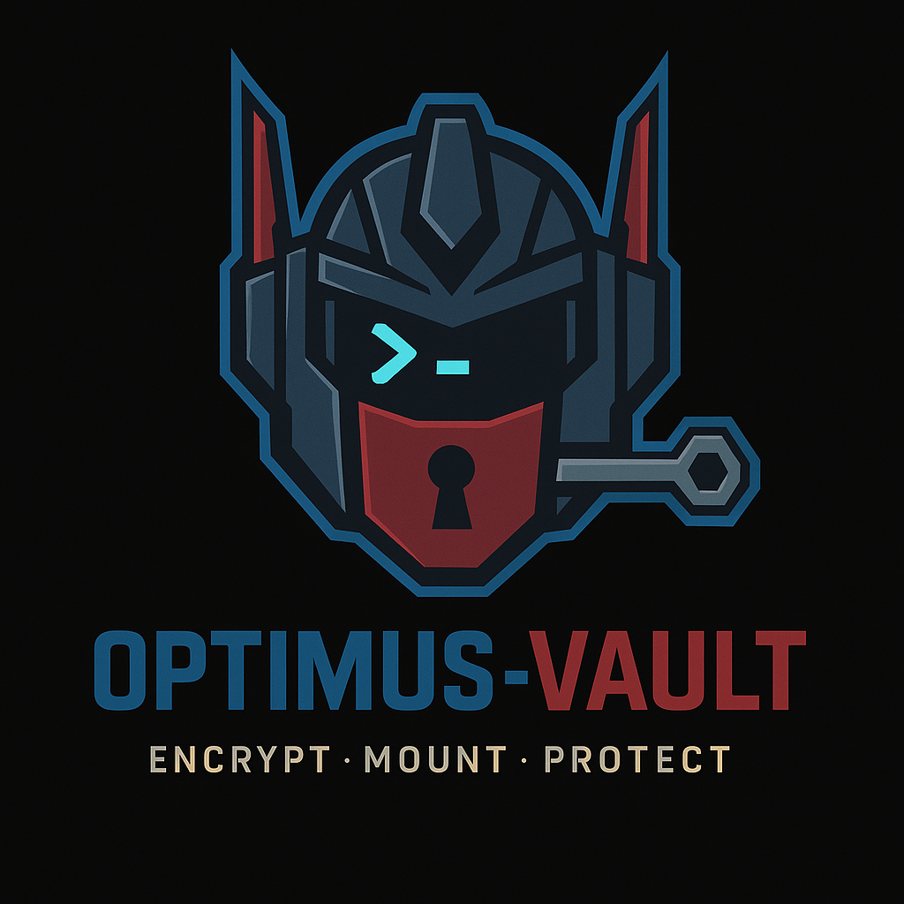

<p align="center">
  
</p>

# 🔐 OPTIMUS VAULT

**Environnement sécurisé chiffré avec gestion GPG et SSH intégrée**

---

## 📋 Description

OPTIMUS VAULT est un script Bash permettant de créer, gérer et utiliser un environnement sécurisé chiffré. Il offre une solution complète pour le stockage sécurisé de données, clés GPG et configurations SSH.

## ✨ Fonctionnalités

### 🛡️ **Environnement sécurisé**
- Chiffrement LUKS avec mot de passe personnalisé
- Système de fichiers ext4 intégré
- Taille configurable de l'environnement
- Montage/démontage automatisé

### 🔑 **Gestion GPG automatisée**
- Création automatique de paires de clés GPG
- Export sécurisé des clés publiques et privées
- Import/Export bidirectionnel entre coffre et trousseau système
- Keyring isolé dans l'environnement chiffré

### 🌐 **Configuration SSH avancée**
- Template de configuration SSH prêt à l'emploi
- Alias `evsh` pour accès rapide avec configuration du coffre
- Import sélectif des configurations SSH existantes par host
- Gestion automatique des permissions (600/700)

---

## 🚀 Installation & Utilisation

### Prérequis
```bash
# Packages requis
sudo apt install cryptsetup gnupg
```

### Lancement
```bash
chmod +x optimusvault.sh
./optimusvault.sh
```

### Menu principal
```
1) Installer (créer + chiffrer + monter)
2) Ouvrir l'environnement  
3) Fermer l'environnement
4) Gestion GPG
5) Configuration SSH
6) Quitter
```

---

## 📖 Guide d'utilisation

### 🏗️ **Première utilisation**
1. **Option 1** : Créer un nouvel environnement
   - Choisir la taille (ex: 100M, 1G, 5G)
   - Définir un mot de passe sécurisé
   
2. **Option 4** : Configurer GPG
   - Génération automatique de clés RSA 4096 bits
   - Export automatique dans le coffre
   
3. **Option 5** : Configurer SSH
   - Création du template de configuration
   - Activation de l'alias `evsh`

### 🔄 **Utilisation quotidienne**
1. **Option 2** : Ouvrir l'environnement
2. Accéder aux fonctions GPG/SSH
3. **Option 3** : Fermer proprement

### 🔐 **Gestion des clés GPG**
- **Import coffre → système** : Utiliser les clés GPG du coffre
- **Export système → coffre** : Sauvegarder les clés système dans le coffre

---

## 🏗️ Architecture

```
~/.optimus_vault_mount/
├── .gnupg/                 # Keyring GPG isolé
├── .ssh/                   # Configuration SSH
│   └── config             # Template SSH
├── gpg_exports/           # Exports de clés GPG
└── ssh_configs/           # Configurations SSH importées
```

---

## 🔒 Sécurité

- **Chiffrement** : LUKS avec algorithme AES
- **Permissions** : 700 pour répertoires, 600 pour fichiers sensibles
- **Isolation** : Keyring GPG séparé du système
- **Mot de passe** : Gestion sécurisée via fichiers temporaires

---

## 🛠️ Fonctionnalités techniques

### Gestion des permissions
- Résolution automatique des problèmes UID/GID
- Support des noms d'utilisateur avec caractères spéciaux
- Ownership automatique après montage

### Robustesse
- Gestion d'erreur complète
- Logs détaillés des opérations
- Nettoyage automatique des fichiers temporaires
- Vérifications de dépendances

---

## 📝 Exemples d'usage

### Configuration SSH personnalisée
```bash
# Le fichier ~/.optimus_vault_mount/.ssh/config contient :
Host monserveur
    HostName server.example.com
    User myuser
    IdentityFile ~/.ssh/id_rsa_server
    
# Utilisation avec l'alias :
evsh monserveur
```

### Export/Import GPG
```bash
# Export toutes les clés système vers le coffre
Option 4 → Option 4 → "all"

# Import clés du coffre vers le système  
Option 4 → Option 3 → "y"
```

---

## 🎯 Conformité partiel

✅ **Part I** : Environnement sécurisé LUKS/ext4  
✅ **Part II** : Cryptographie GPG automatisée  
✅ **Part III** : Configuration SSH + alias evsh + import  
✅ **Part IV** : Import/Export GPG bidirectionnel  

---

## 👤 Auteur : Adramalech

**Projet réalisé dans le cadre du partiel Linux Avancé**

---

*OPTIMUS VAULT - Votre coffre-fort personnel* 🛡️